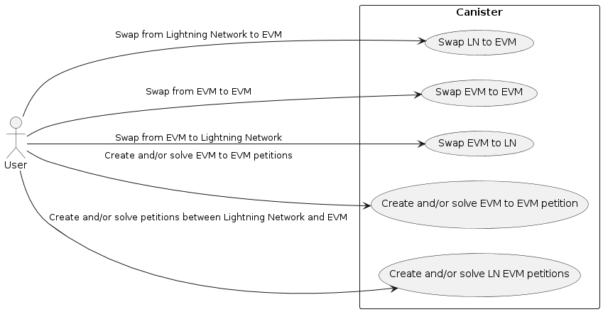
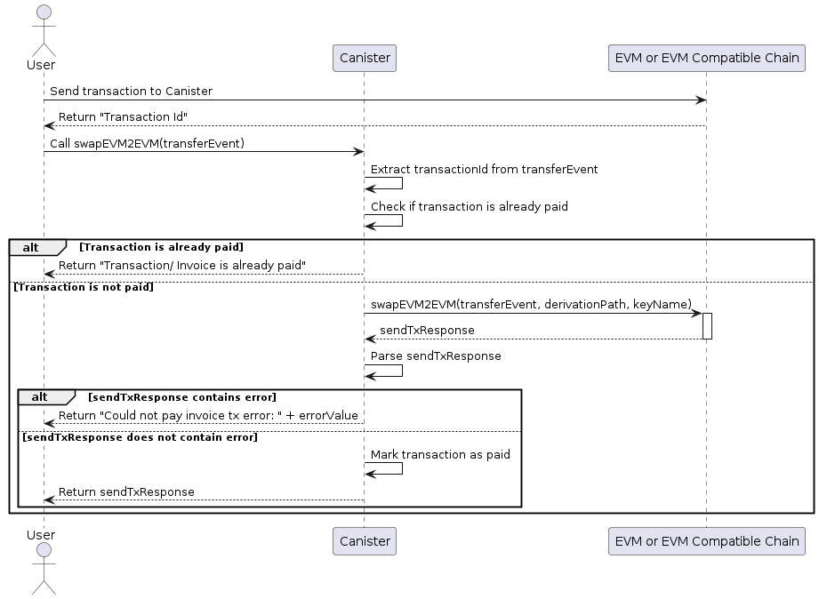
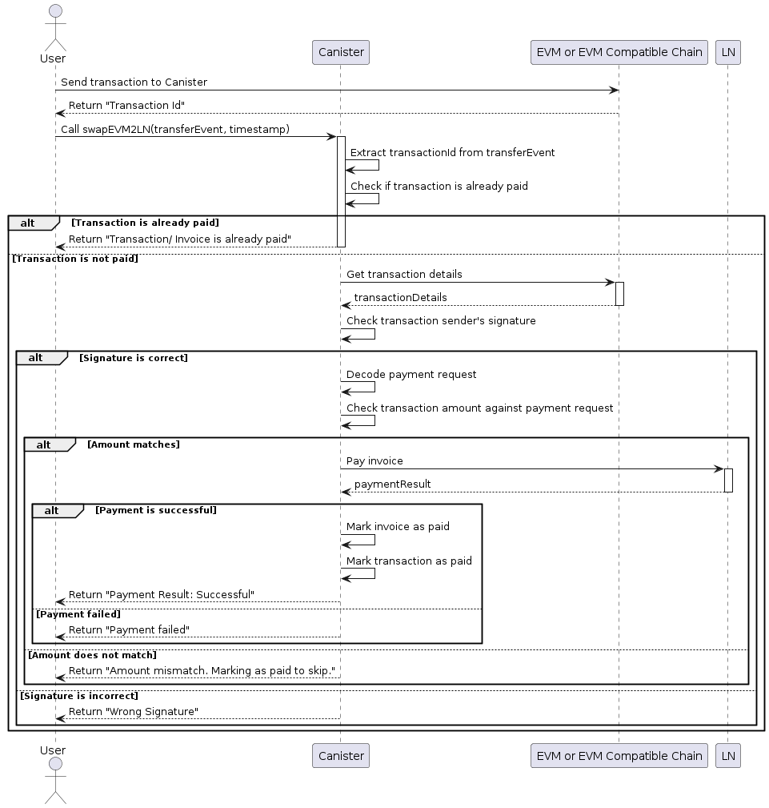
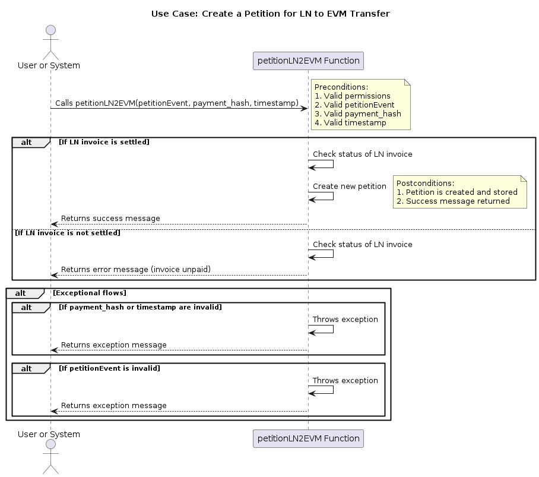
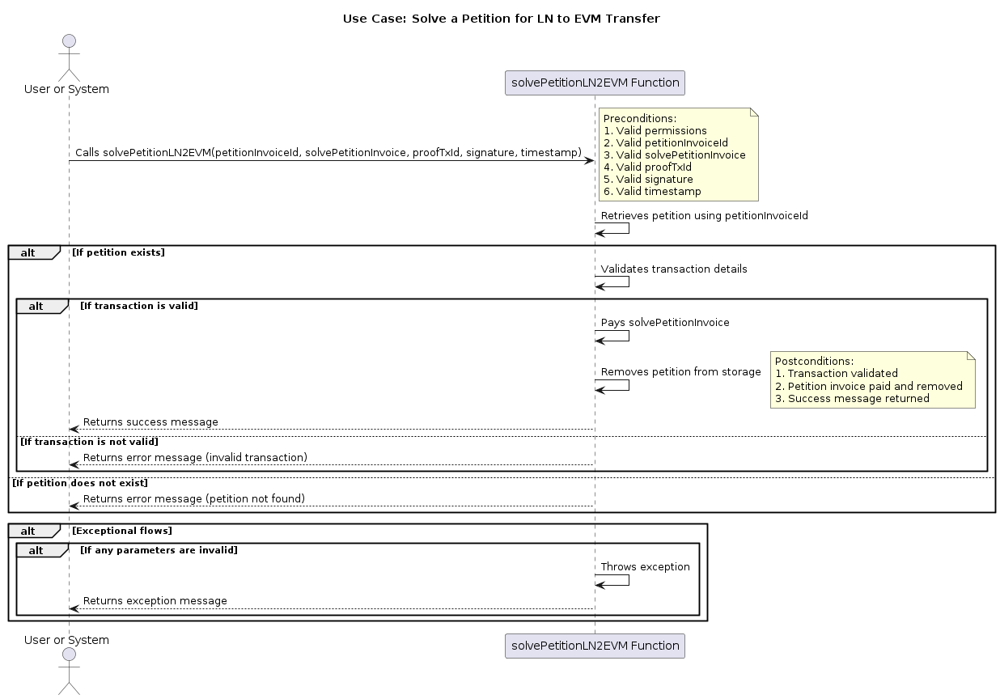
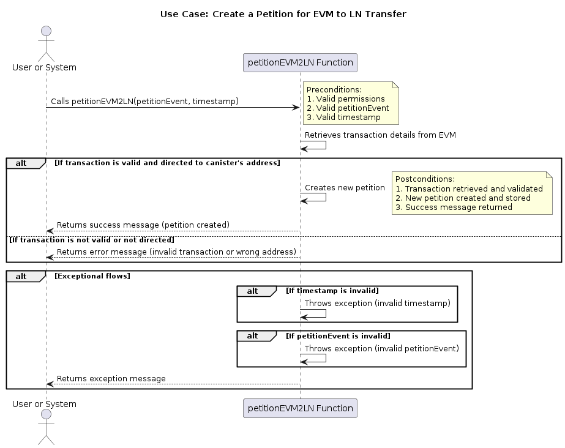

# ICP Canister Bridge Project

## Introduction
The ICP Canister Bridge is a groundbreaking project that bridges the gap between the Ethereum Virtual Machine (EVM) compatible chains and the Lightning Network, using the Internet Computer Protocol (ICP) stack. This bridge is designed to facilitate seamless swaps of satoshis between the Lightning Network and EVM-compatible chains, providing a secure and efficient transactional framework.

The ICP Canister Bridge operates on the principle of ECDSA API, ensuring secure transactions across EVM-compatible chains. It offers two distinct methods for performing swaps: a peer-to-peer marketplace-like system and swaps executed by the canister itself. This flexibility allows users to choose the method that best suits their needs and preferences.

The ICP Canister Bridge is a cornerstone of the ICP ecosystem, contributing to the development of a more interconnected and efficient blockchain ecosystem. It is a testament to the potential of the ICP stack and its ability to bridge the gap between different blockchain networks, opening up new possibilities for cross-chain transactions and interoperability.

## Key Features
- **Integration with ECDSA API:** Ensures high security for transactions.
- **Compatibility with EVM Chains:** Enables smooth transactions across different EVM chains.
- **Potential Lightning Network Support:** Explores integration possibilities with Bitcoin's Lightning Network.

## Technologies Used
- **ICP for HTTP Requests:** Utilizes ICP for communicating with an Express.js API.
- **ICP Canister:** Interacts with EVM chain and Lightning networks.
- **Express.js API:** Handles requests from the canister.
- **Motoko, Webln, Ethers.js:** These technologies are integral to the project's functionality.

## Getting Started
1. **Installation:**
   - Clone the repository: `git clone [repository URL]`.
   - Install DFX, the development and deployment tool for the Internet Computer.
   - Navigate to the project directory and initialize the project using `dfx init`.
   - Install necessary dependencies as outlined in the project's `package.json`.

2. **Configuration:**
   - Configure `dfx.json` for your local and network settings.
   - Set up environment variables for interacting with the ICP network and other services (e.g., API keys, network addresses).
   - If interacting with EVM chains, configure the connection settings and smart contract addresses.
   - Test the configuration by deploying a local version using `dfx deploy`.

## Use Cases and UML Diagrams

### Use Case: Swap EVM to EVM

Actor: User

Preconditions:
- The user has a valid TransferEvent.
- The user has a valid derivation path.
- The user has a valid key name.

Flow of Events:
- User sends a transaction to the canister's address. It returns the transaction id.
- The user calls the swapEVM2EVM function with the required TransferEvent.
- The function checks if the transaction has already been paid. If it has, it returns an error message.
- The function performs the swap from the EVM to another EVM or to another EVM compatible chain.
- If the swap is successful, the function marks the transaction as paid and returns the response.
- If the swap fails, the function returns an error message.

Postconditions:
- If the transaction has already been paid, the user is notified.
- If the swap is successful, the user is notified and the transaction is marked as paid.
- If the swap fails, the user is notified.

### Use Case: Swap EVM to Lightning Network

Actor: User

Preconditions:
- The user has a valid TransferEvent.
- The user has a valid timestamp.
- The user has a valid derivation path.
- The user has a valid key name.

Flow of Events:
- User sends a transaction to the canister's address. It returns the transaction id.
- The user calls the swapEVM2LN function with the required TransferEvent and timestamp.
- The function checks if the transaction has already been paid. If it has, it returns an error message.
- The function retrieves the transaction details from the EVM.
- The function checks the transaction sender's signature against the expected signature.
- If the signature is correct, the function decodes the payment request from the TransferEvent.
- The function checks the amount in the payment request against the transaction amount.
- The function attempts to pay the invoice using the Lightning Network.
- If the payment is successful, the function marks the invoice as paid and the transaction as paid.
- The function returns the payment result.

Postconditions:
- If the transaction has already been paid, the user is notified.
- If the signature is incorrect, the user is notified.
- If the amount in the payment request does not match the transaction amount, the user is notified.
- If the payment is successful, the user is notified and the invoice and transaction are marked as paid.

### Use Case: Create a Petition for LN to EVM Transfer

Actor: User

Preconditions
- The user or system has the necessary permissions to call the function.
- The `petitionEvent` parameter is a valid petition event.
- The `payment_hash` parameter is a valid Lightning Network payment hash.
- The `timestamp` parameter is a valid timestamp.

Postconditions
- The function successfully checks the status of the LN invoice.
- If the invoice is settled, a new petition is created and stored.
- The function returns a success message indicating that the petition was created successfully.

Normal Flow
1. The `petitionLN2EVM` function is called with the `petitionEvent`, `payment_hash`, and `timestamp` parameters.
2. The function checks the status of the LN invoice using the provided `payment_hash` and `timestamp`.
3. If the invoice is not settled, the function returns an error message indicating that the invoice needs to be paid and retried.
4. If the invoice is settled, the function creates a new petition with the invoice details and the `petitionEvent`.
5. The function returns a success message indicating that the petition was created successfully.

Exceptional Flows
- If the `payment_hash` or `timestamp` are invalid, the function will throw an exception.
- If the `petitionEvent` is not a valid event, the function will throw an exception.

### Use Case: Solve a Petition for LN to EVM Transfer

Actor: User

Preconditions
- The user or system has the necessary permissions to call the function.
- The `petitionInvoiceId` parameter is a valid identifier for an existing petition.
- The `solvePetitionInvoice` parameter is a valid Lightning Network invoice for solving the petition.
- The `proofTxId` parameter is a valid transaction ID for the proof of the transaction.
- The `signature` parameter is a valid signature for the transaction.
- The `timestamp` parameter is a valid timestamp.

Postconditions
- The function successfully validates the transaction details and the proof of the transaction.
- If the transaction is valid, the function pays the `solvePetitionInvoice` and removes the petition from storage.
- The function returns a success message indicating that the transaction was valid and the payment was successful, or an error message if the transaction was invalid or the payment failed.

Normal Flow
1. The `solvePetitionLN2EVM` function is called with the required parameters.
2. The function retrieves the petition event using the `petitionInvoiceId`.
3. If the petition exists, the function validates the transaction details.
4. If the transaction is valid, the function pays the `solvePetitionInvoice`.
5. The function removes the petition from storage.
6. The function returns a success message.

Alternative Flows
- If the petition does not exist, the function returns an error message.
- If the transaction is not valid, the function returns an error message.
- If the payment fails, the function returns an error message.

Exceptional Flows
- If any of the parameters are invalid, the function will throw an exception.

### UseCase: Create a Petition for EVM to LN Transfer

Actor: User

Preconditions
- The user or system has the necessary permissions to call the function.
- The `petitionEvent` parameter contains the details of the EVM to LN transfer.
- The `timestamp` parameter is a valid timestamp.

Postconditions
- The function successfully retrieves the transaction details from the EVM.
- If the transaction is valid, a new petition is created and stored.
- The function returns a success message indicating that the petition was created successfully, or an error message if the transaction was invalid.

Normal Flow
1. The `petitionEVM2LN` function is called with the `petitionEvent` and `timestamp` parameters.
2. The function retrieves the transaction details from the EVM.
3. The function checks if the transaction is valid and directed to the canister's address.
4. If the transaction is valid, a new petition is created and stored.
5. The function returns a success message indicating that the petition was created successfully.

Alternative Flows
- If the transaction is not valid or not directed to the canister's address, the function returns an error message.

Exceptional Flows
- If the `timestamp` is invalid, the function will throw an exception.
- If the `petitionEvent` is not valid, the function will throw an exception.

### UseCase: Solve a Petition for EVM to LN Transfer

Actor: User

Preconditions
- The user or system has the necessary permissions to call the function.
- The `invoiceId` parameter is a valid Lightning Network invoice ID.
- The `petitionTxId` parameter is a valid transaction ID for the petition.
- The `destAddress` parameter is a valid Ethereum address to receive the funds.
- The `timestamp` parameter is a valid timestamp.

Postconditions
- The function successfully retrieves the transaction details from the EVM.
- The function creates and sends a transaction to the `destAddress` using the Lightning Network.
- The function returns a success message indicating that the transaction was successful.

Normal Flow
1. The `solvePetitionEVM2LN` function is called with the required parameters.
2. The function retrieves the transaction details from the EVM.
3. The function creates and sends a transaction to the `destAddress` using the Lightning Network.
4. The function returns a success message indicating that the transaction was successful.

Alternative Flows
- If the transaction details are not valid, the function returns an error message.
- If the transaction creation or sending fails, the function returns an error message.

Exceptional Flows
- If any of the parameters are invalid, the function will throw an exception.

## How to Use
- Detailed user guides are available in the repository for initiating and managing cross-chain transactions.

## Contributing
We encourage contributions to this project. Please adhere to the project's contribution guidelines for submitting code or suggestions.

## License
This project is licensed under the [MIT License](LICENSE).

## Support and Contact
For questions, support, or feedback, please open an issue in the GitHub repository.

For a comprehensive understanding, visit the [ICP Canister Bridge GitHub Repository](https://github.com/Bitcoin-AI/icp-canister-bridge) and the [Devpost page](https://devpost.com/software/icp-canister-bridge).
